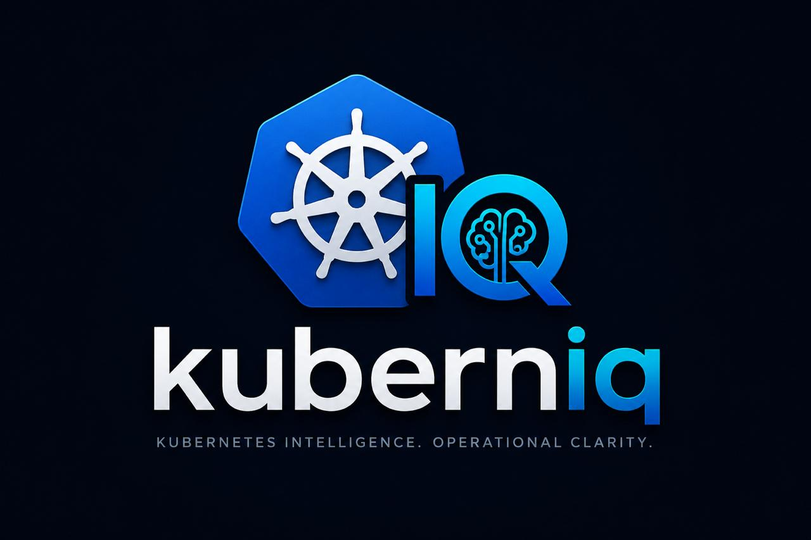

<p align="center">
  
</p>

# Kuberniq

Kuberniq is an AI-powered Kubernetes operational intelligence platform that combines live cluster context, observability data, and RAG-based analysis to simplify troubleshooting, diagnostics, and platform operations across Kubernetes environments.

---

## Repository Structure

```
kuberniq/
├── kuberniq-chat/      # Next.js + FastAPI AI chatbot
├── kuberniq-server/    # .NET 10 MCP server exposing live cluster context
├── kuberniq/           # CLI for registering and managing remote clusters
└── helm/               # Helm charts for deploying the chatbot and server
```

---

## Components

### 🤖 [kuberniq-chat](./kuberniq-chat/README.md) — AI Chatbot

A Streamlit-based conversational UI that answers natural language questions about your Kubernetes clusters. All answers are grounded in **live cluster data** fetched from the MCP server — no hallucinated pod names, no stale state.

**Highlights:**
- Natural language queries over pods, logs, events, deployments, HPAs, and more
- Auto-troubleshoot mode that fans out across events, logs, deployment state, and resource quotas in one go
- YAML manifest analysis for security and misconfiguration review
- Helm packaged for easy cluster deployment

---

### 🖥️ [kuberniq-server](./kuberniq-server/README.md) — MCP Server

A lightweight .NET 10 minimal API that exposes read-only Kubernetes cluster context over HTTP. Runs in-cluster and serves as the data layer for the chatbot.

**Highlights:**
- 40+ endpoints covering every major Kubernetes resource type
- Full SPA dashboard at `/` with sidebar navigation, namespace switcher, resource tables, and a log viewer
- Multi-cluster routing via `?cluster=<name>` after registering clusters with the CLI
- In-cluster credentials when deployed; falls back to `~/.kube/config` locally
- Helm packaged and ArgoCD compatible

---

### 🔧 [kuberniq](./kuberniq/README.md) — CLI

A cross-platform CLI for registering and managing remote Kubernetes clusters with the MCP server. One command sets up everything in the target cluster and wires up multi-cluster routing.

**Highlights:**
- Single-command cluster registration (`kuberniq cluster add <name>`)
- Pre-built binaries for macOS, Linux, and Windows — no .NET runtime required
- Install via one-liner curl script or build from source with `make`

---

### ⎈ [helm](./helm/) — Helm Charts

Helm charts for deploying both the chatbot and server to any Kubernetes cluster.

| Chart | Path |
|---|---|
| `kuberniq-server` | `helm/Application/kuberniq-server/` |
| `kuberniq-chat` | `helm/Application/kuberniq-chat/` |

---

## Quick Start

### 1. Deploy the MCP Server

```bash
helm upgrade --install kuberniq-server helm/Application/kuberniq-server \
  --namespace kuberniq-server \
  --create-namespace
```

### 2. Deploy the Chatbot

```bash
kubectl create secret generic kuberniq-chat-secrets \
  --from-literal=OPENAI_API_KEY=sk-... \
  -n kuberniq-chat

helm upgrade --install kuberniq-chat helm/Application/kuberniq-chat \
  --namespace kuberniq-chat \
  --create-namespace \
  --set mcpServerUrl=http://kuberniq-server.kuberniq-server.svc.cluster.local:8080
```

### 3. Register Additional Clusters (optional)

```bash
# Install the CLI
curl -fsSL https://raw.githubusercontent.com/oluwaTG/kuberniq/main/kuberniq/install.sh | bash

# Point it at your server and register a cluster
kuberniq login http://your-kuberniq-server
kuberniq cluster add prod --context prod-aks
```

---

## Docker Images

| Component | Image |
|---|---|
| MCP Server | `elumole22/kuberniq-server` |
| Chatbot | `elumole22/kuberniq-chat` |

---

## License

MIT
